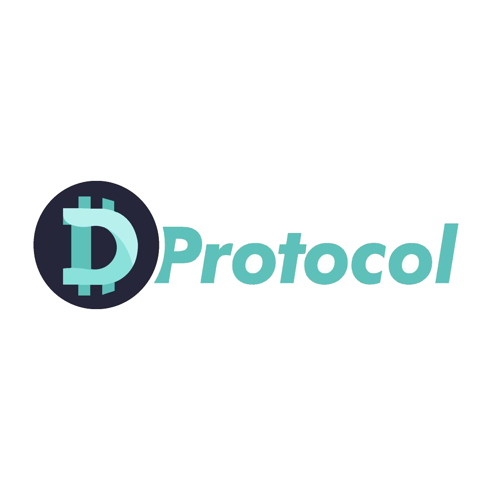

&nbsp;

## Que es Dprotocol?

Dprotocol es un proyecto Open Source el cual se concibe como una gran apuesta de la industria para aportar a un macro objetivo, la descentralización de la
economía y de los mercados en Colombia y en el mundo entero.
  
El anterior cometido se logrará a través de la creación e implementación de una blockchain propia revestida de un protocolo de consenso Tendermint, nuevo protocolo que facilita el ordenamiento de eventos en una red distribuida en condiciones adversas. Más comúnmente conocido como algoritmo de consenso bizantino tolerante a fallas (BFT), problema que atrae una atención significativa los últimos años debido al éxito generalizado de las monedas digitales basadas en blockchain. 
  
Dprotocol, tendrá una moneda nativa volátil DLY que permitirá generar un staking controlado que estimulará la producción de nuevos bloques en la red y servirá también para pagar los fees de la misma. Al ser un proyecto Open Source, se espera de Dprotocol un crecimiento de su uso de manera exponencial por parte de todos los sectores de la economía, particulares, públicos o privados que deseen dar un salto de calidad apoyándose en el uso de la Tecnología 4.0. 
  
Si usted tiene la intención de trabajar con el código fuente de Dprotocol se espera que usted ya esté familiarizado también con todos los conceptos que giran en torno a este proyecto.
